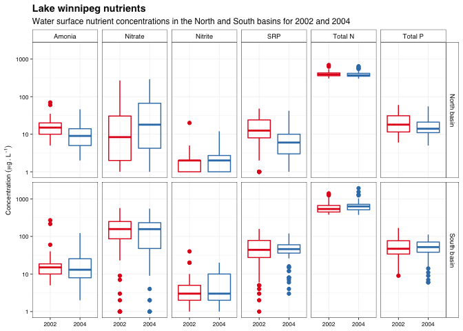
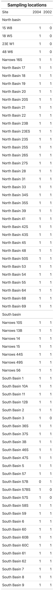

# Week 11 - Homework   Data wrangling and exploration

Welcome to your assignment for **week 11**. As usual, **Clone** this repo into your own :computer: using RStudio, as we saw in class.

For this week's assignment you will need to create a short **"report" in an rmarkdown** format with its associated `.md` and `.html` outputs.

This week's assignment is a bit longer and more comprehensive than other weeks as we will be practicing skills seen in both week 10 and week 11. You will be tasked with completing a full workflow involving loading different data files and joining/binding them as needed to create a single data set that can then be used for some data exploration and plotting.

## The data

For this week's assignment we are going to use a data set of water chemistry data from **Lake Winnipeg** collected by **DFO**. The data is publicly available at the [**DataStream portal**](https://lakewinnipegdatastream.ca/explore/#/dataset/d9f476e5-a80b-4499-9c94-e61d8b83dba3/?ref=map&locations=2140&percentiles=&guideline=&characteristic_media=Surface%2520Water&characteristic_characteristic_name=Silicon&characteristic_method_speciation=&characteristic_sample_fraction=Suspended&characteristic_field=false&characteristic_unit=%25C2%25B5g%252FL).

I have modified the data a bit to make it more suited to the learning objectives of this assignment (i.e. binding and joining tables) as well as to simplify the number of parameters keeping only nutrient (Nitrogen and Phosphorus) data. I have also added a commonly used variable *Basin*, to further explore whether there are any differences between the two basins of the lake.

## Your tasks

1.  As mentioned, your main task for this homework assignment is to use everything we have seen in class so far to complete a full workflow involving loading different data files and joining/binding them as needed to create a single data set that can then be used for some data exploration and plotting.
2.  Apart from the back-end data wrangling and clean-up work needed to get the data to a working state, you will need to perform some exploratory work to answer the question **"In what years was each sampling sites sampled?"** for this i would like you to output a table like the one at the end of this document.
3.  You will also need to create a summary figure similar to the one below (of course, using your own theme), which would allow us to compare the nutrient loads in the surface water of Lake Winnipeg between 2002 and 2004 as well as between the two basins.

Just like last week, this is not a replication exercise. This figure was made using a theme I created for this class, feel free to apply your own theme. Do try to keep the main elements related to the data itself.

## A few hints

-   Make sure to save your `.rmd` file in the rmarkdown folder **before** you knit your file
-   You will need to use the **{here}** package to correctly load the ditch data into the `.Rmd` file as well as to save the figures.
-   Pay special attention to the values for the different parameters. You will see a binch of samples below the detection limit (Expressed as "\<LOD"). You will need to deal with these before you can plot the data. I recommend you replace these for zeros.
-   you will notice that 2002 and 2204 are individual categories (factors) in the plot. Make sure the data reflects that.
-   You will notice that the names of the compounds have been edited to look nicer in the facet titles. See if you can do that too,

## wrap-up

In addition to being shown in the final report, the final table and figure should be saved in `.pdf` format with a width of 190 mm

Finally, once you have completed the exercises, as usual:

-   Once you are done with the R script files, save the changes, make sure scripts are properly saved in te **R** folder.
-   Commit all the changes to the *repo/R project* (remember to write a commit mesage!)
-   **Push** all changes back to **GitHub**
-   Go to GitHub and check that it all worked out

## Reminder

-   In the TidyTuesday assignment and Exam you will be deducted points for not following proper file structure inside your repo/project, so make sure you start developing good practices now. This applies as well to coding style, so make sure to review the [Tidyverse style guide](https://style.tidyverse.org/)

As always, feel free to use the [Homework Issues](%5Bhttps://github.com/orgs/UM-R-for-EnvSci-Fall-2022/discussions/categories/homework-issues) section of the [discussion](%5Bhttps://github.com/orgs/UM-R-for-EnvSci-Fall-2022/discussions) section to reach out to your classmates if you have any questions. Remember that this is a way to practice how to engage in something like Stack Overflow or similar. I will be monitoring it, and if you are not getting any help, I'll jump in! Remember you can always tag me or any classmate in a comment for quicker replies!

*Happy coding!*

Pepe

