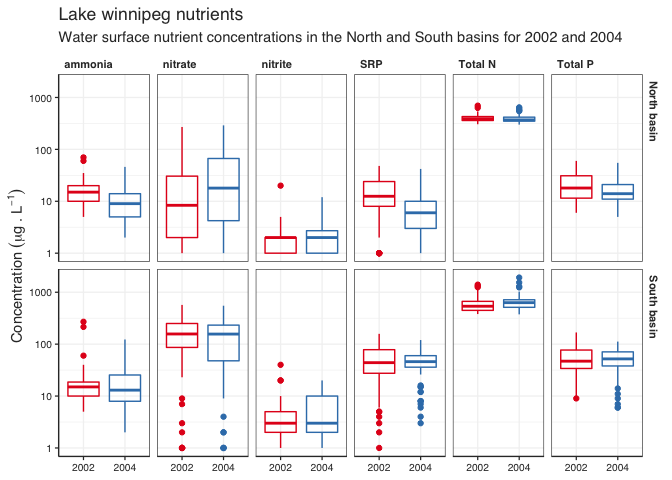

# Data loading

First we start by loading up all the data


```r
low_sites <- read_csv(here("data", "sites.csv"))
```

```
## Rows: 83 Columns: 7
## ── Column specification ────────────────────────────────────────────────────────
## Delimiter: ","
## chr (5): monitoring_location_id, monitoring_location_name, monitoring_locati...
## dbl (2): monitoring_location_latitude, monitoring_location_longitude
## 
## ℹ Use `spec()` to retrieve the full column specification for this data.
## ℹ Specify the column types or set `show_col_types = FALSE` to quiet this message.
```

```r
low_sample_log <- read_csv(here("data", "sample_log.csv"))
```

```
## Rows: 332 Columns: 11
## ── Column specification ────────────────────────────────────────────────────────
## Delimiter: ","
## chr (5): sample_id, monitoring_location_id, activity_type, activity_media_na...
## dbl (6): activity_depth_height_measure, day, month, year, hour, minute
## 
## ℹ Use `spec()` to retrieve the full column specification for this data.
## ℹ Specify the column types or set `show_col_types = FALSE` to quiet this message.
```

```r
low_results_2002 <- read_csv(here("data", "results_2002.csv"))
```

```
## Rows: 165 Columns: 7
## ── Column specification ────────────────────────────────────────────────────────
## Delimiter: ","
## chr (7): sample_id, nitrate, nitrite, ammonia, total_nitrogen_mixed_forms, s...
## 
## ℹ Use `spec()` to retrieve the full column specification for this data.
## ℹ Specify the column types or set `show_col_types = FALSE` to quiet this message.
```

```r
low_results_2004 <- read_csv(here("data", "results_2004.csv"))
```

```
## Rows: 161 Columns: 7
## ── Column specification ────────────────────────────────────────────────────────
## Delimiter: ","
## chr (7): sample_id, nitrate, nitrite, ammonia, total_nitrogen_mixed_forms, s...
## 
## ℹ Use `spec()` to retrieve the full column specification for this data.
## ℹ Specify the column types or set `show_col_types = FALSE` to quiet this message.
```

# Data binding and joining

With all the data loaded, we are going to start binding and joining the different oieces to get to our main, combined,dataset

Let's start by binding the two years of results data into one:


```r
low_results <- bind_rows(low_results_2002, low_results_2004)

low_results
```

```
## # A tibble: 326 × 7
##    sample_id nitrate nitrite ammonia total_nitrogen_mixed_forms solubl…¹ total…²
##    <chr>     <chr>   <chr>   <chr>   <chr>                      <chr>    <chr>  
##  1 W_277     430     20      270     1400                       74       77     
##  2 W_279     270     10      20      670                        41       44     
##  3 W_278     <LOD    1       10      435                        18       25     
##  4 W_281     86      3       15      455                        33       40     
##  5 W_282     87      3       15      485                        29       34     
##  6 W_283     140     5       10      540                        32       36     
##  7 W_289     <LOD    <LOD    10      430                        16       25     
##  8 W_291     <LOD    1       10      405                        23       32     
##  9 W_298     2       1       15      445                        5        14     
## 10 W_299     9       2       25      455                        8        19     
## # … with 316 more rows, and abbreviated variable names
## #   ¹​soluble_reactive_phosphorus_srp, ²​total_phosphorus_mixed_forms
```

Now that we have our complete hree pieces (sites, sample_log, and results), we want to join thse toguether. For that we will use the `left_join()` function starting by joining the sample log to the site info (using *monitoring_location_id* as our key column) followed by a left yoing with the results data (using *sample_id* as our key column)


```r
low_data <- low_sample_log %>% 
  left_join(low_sites, by = "monitoring_location_id") %>% 
  left_join(low_results, by = "sample_id")

low_data
```

```
## # A tibble: 332 × 23
##    sample_id monitorin…¹ activ…² activ…³ activ…⁴ activ…⁵   day month  year  hour
##    <chr>     <chr>       <chr>   <chr>     <dbl> <chr>   <dbl> <dbl> <dbl> <dbl>
##  1 W_277     1           Sample… Surfac…      NA <NA>        6     1  2002    10
##  2 W_278     2           Sample… Surfac…      NA <NA>        6     1  2002    13
##  3 W_279     3B          Sample… Surfac…      NA <NA>        6     1  2002    14
##  4 W_281     59          Sample… Surfac…      NA <NA>        6     2  2002    12
##  5 W_282     5           Sample… Surfac…      NA <NA>        6     2  2002    13
##  6 W_283     60C         Sample… Surfac…      NA <NA>        6     2  2002    14
##  7 W_289     57B         Sample… Surfac…      NA <NA>        6     5  2002    14
##  8 W_291     60B         Sample… Surfac…      NA <NA>        6     6  2002    15
##  9 W_298     57          Sample… Surfac…      NA <NA>        6    11  2002    12
## 10 W_299     11          Sample… Surfac…      NA <NA>        6    11  2002    17
## # … with 322 more rows, 13 more variables: minute <dbl>,
## #   monitoring_location_name <chr>, monitoring_location_latitude <dbl>,
## #   monitoring_location_longitude <dbl>,
## #   monitoring_location_horizontal_coordinate_reference_system <chr>,
## #   monitoring_location_waterbody <chr>, basin <chr>, nitrate <chr>,
## #   nitrite <chr>, ammonia <chr>, total_nitrogen_mixed_forms <chr>,
## #   soluble_reactive_phosphorus_srp <chr>, …
```

# Data processing

Now that we have one single, combine, dataset, we still need to do some processing. 

- First we will use `pivot_longer()` to change the parameter columns into long form.
- second we need to deal with the **no detects**. We are going to change them for a zero.
- Third we will `mutate()` the year variable into a factor to ensure we can create our boxplots.
- Finally, we will "pretyfy" the names of the parameters so they display betteer in the figure


```r
low_data_long <- low_data %>% 
  pivot_longer(cols = c(nitrate,nitrite,
                        ammonia,
                        total_nitrogen_mixed_forms,
                        soluble_reactive_phosphorus_srp,
                        total_phosphorus_mixed_forms),
               names_to = "parameter",
               values_to = "concentration") %>% 
  mutate(concentration = str_replace(concentration, "<LOD", "0")) %>% 
  mutate(concentration = as.numeric(concentration)) %>% 
  mutate(year = factor(year, levels = c("2002", "2004"))) %>% 
  mutate(parameter = case_when(
    parameter == "total_nitrogen_mixed_forms" ~ "Total N",
    parameter == "soluble_reactive_phosphorus_srp" ~ "SRP",
    parameter == "total_phosphorus_mixed_forms" ~ "Total P",
    TRUE ~ parameter  # This line tells case_when() that any other case just gets whatever value parameter had already
  ))

low_data_long
```

```
## # A tibble: 1,992 × 19
##    sample_id monitorin…¹ activ…² activ…³ activ…⁴ activ…⁵   day month year   hour
##    <chr>     <chr>       <chr>   <chr>     <dbl> <chr>   <dbl> <dbl> <fct> <dbl>
##  1 W_277     1           Sample… Surfac…      NA <NA>        6     1 2002     10
##  2 W_277     1           Sample… Surfac…      NA <NA>        6     1 2002     10
##  3 W_277     1           Sample… Surfac…      NA <NA>        6     1 2002     10
##  4 W_277     1           Sample… Surfac…      NA <NA>        6     1 2002     10
##  5 W_277     1           Sample… Surfac…      NA <NA>        6     1 2002     10
##  6 W_277     1           Sample… Surfac…      NA <NA>        6     1 2002     10
##  7 W_278     2           Sample… Surfac…      NA <NA>        6     1 2002     13
##  8 W_278     2           Sample… Surfac…      NA <NA>        6     1 2002     13
##  9 W_278     2           Sample… Surfac…      NA <NA>        6     1 2002     13
## 10 W_278     2           Sample… Surfac…      NA <NA>        6     1 2002     13
## # … with 1,982 more rows, 9 more variables: minute <dbl>,
## #   monitoring_location_name <chr>, monitoring_location_latitude <dbl>,
## #   monitoring_location_longitude <dbl>,
## #   monitoring_location_horizontal_coordinate_reference_system <chr>,
## #   monitoring_location_waterbody <chr>, basin <chr>, parameter <chr>,
## #   concentration <dbl>, and abbreviated variable names
## #   ¹​monitoring_location_id, ²​activity_type, ³​activity_media_name, …
```

# Data exploration

## Were all the sites sampled every year?

We are going to use `distinct()` to create a sumary table of distinct combinations of site and year. We are also going to add basin so we can use this info later on (the presence of basin does not change the results as the sites can only belong to one basin. Then we `count()` with the same parameters to generate a column of ones that we will need for the next step.

In the next step we use `pivot_wider()` to expand the year counts into two columns, one for each year and we ask it to fill the convinations not present in our list (sites not sampled in a particular year) with zeros.

Then we just use `gt()` to create a nicer table


```r
site_sumary_table <- low_data_long %>% 
  distinct(basin, monitoring_location_name, year) %>% 
  count(basin, monitoring_location_name, year) %>% 
  pivot_wider(names_from = year, values_from = n, values_fill = 0) %>% 
  rename(Site = monitoring_location_name) %>% 
  gt(groupname_col = "basin") %>% 
  tab_header(
    title = md("**Sampling locations**"))

site_sumary_table
```

```{=html}
<div id="ygmtyhmgwt" style="overflow-x:auto;overflow-y:auto;width:auto;height:auto;">
<style>html {
  font-family: -apple-system, BlinkMacSystemFont, 'Segoe UI', Roboto, Oxygen, Ubuntu, Cantarell, 'Helvetica Neue', 'Fira Sans', 'Droid Sans', Arial, sans-serif;
}

#ygmtyhmgwt .gt_table {
  display: table;
  border-collapse: collapse;
  margin-left: auto;
  margin-right: auto;
  color: #333333;
  font-size: 16px;
  font-weight: normal;
  font-style: normal;
  background-color: #FFFFFF;
  width: auto;
  border-top-style: solid;
  border-top-width: 2px;
  border-top-color: #A8A8A8;
  border-right-style: none;
  border-right-width: 2px;
  border-right-color: #D3D3D3;
  border-bottom-style: solid;
  border-bottom-width: 2px;
  border-bottom-color: #A8A8A8;
  border-left-style: none;
  border-left-width: 2px;
  border-left-color: #D3D3D3;
}

#ygmtyhmgwt .gt_heading {
  background-color: #FFFFFF;
  text-align: center;
  border-bottom-color: #FFFFFF;
  border-left-style: none;
  border-left-width: 1px;
  border-left-color: #D3D3D3;
  border-right-style: none;
  border-right-width: 1px;
  border-right-color: #D3D3D3;
}

#ygmtyhmgwt .gt_title {
  color: #333333;
  font-size: 125%;
  font-weight: initial;
  padding-top: 4px;
  padding-bottom: 4px;
  padding-left: 5px;
  padding-right: 5px;
  border-bottom-color: #FFFFFF;
  border-bottom-width: 0;
}

#ygmtyhmgwt .gt_subtitle {
  color: #333333;
  font-size: 85%;
  font-weight: initial;
  padding-top: 0;
  padding-bottom: 6px;
  padding-left: 5px;
  padding-right: 5px;
  border-top-color: #FFFFFF;
  border-top-width: 0;
}

#ygmtyhmgwt .gt_bottom_border {
  border-bottom-style: solid;
  border-bottom-width: 2px;
  border-bottom-color: #D3D3D3;
}

#ygmtyhmgwt .gt_col_headings {
  border-top-style: solid;
  border-top-width: 2px;
  border-top-color: #D3D3D3;
  border-bottom-style: solid;
  border-bottom-width: 2px;
  border-bottom-color: #D3D3D3;
  border-left-style: none;
  border-left-width: 1px;
  border-left-color: #D3D3D3;
  border-right-style: none;
  border-right-width: 1px;
  border-right-color: #D3D3D3;
}

#ygmtyhmgwt .gt_col_heading {
  color: #333333;
  background-color: #FFFFFF;
  font-size: 100%;
  font-weight: normal;
  text-transform: inherit;
  border-left-style: none;
  border-left-width: 1px;
  border-left-color: #D3D3D3;
  border-right-style: none;
  border-right-width: 1px;
  border-right-color: #D3D3D3;
  vertical-align: bottom;
  padding-top: 5px;
  padding-bottom: 6px;
  padding-left: 5px;
  padding-right: 5px;
  overflow-x: hidden;
}

#ygmtyhmgwt .gt_column_spanner_outer {
  color: #333333;
  background-color: #FFFFFF;
  font-size: 100%;
  font-weight: normal;
  text-transform: inherit;
  padding-top: 0;
  padding-bottom: 0;
  padding-left: 4px;
  padding-right: 4px;
}

#ygmtyhmgwt .gt_column_spanner_outer:first-child {
  padding-left: 0;
}

#ygmtyhmgwt .gt_column_spanner_outer:last-child {
  padding-right: 0;
}

#ygmtyhmgwt .gt_column_spanner {
  border-bottom-style: solid;
  border-bottom-width: 2px;
  border-bottom-color: #D3D3D3;
  vertical-align: bottom;
  padding-top: 5px;
  padding-bottom: 5px;
  overflow-x: hidden;
  display: inline-block;
  width: 100%;
}

#ygmtyhmgwt .gt_group_heading {
  padding-top: 8px;
  padding-bottom: 8px;
  padding-left: 5px;
  padding-right: 5px;
  color: #333333;
  background-color: #FFFFFF;
  font-size: 100%;
  font-weight: initial;
  text-transform: inherit;
  border-top-style: solid;
  border-top-width: 2px;
  border-top-color: #D3D3D3;
  border-bottom-style: solid;
  border-bottom-width: 2px;
  border-bottom-color: #D3D3D3;
  border-left-style: none;
  border-left-width: 1px;
  border-left-color: #D3D3D3;
  border-right-style: none;
  border-right-width: 1px;
  border-right-color: #D3D3D3;
  vertical-align: middle;
}

#ygmtyhmgwt .gt_empty_group_heading {
  padding: 0.5px;
  color: #333333;
  background-color: #FFFFFF;
  font-size: 100%;
  font-weight: initial;
  border-top-style: solid;
  border-top-width: 2px;
  border-top-color: #D3D3D3;
  border-bottom-style: solid;
  border-bottom-width: 2px;
  border-bottom-color: #D3D3D3;
  vertical-align: middle;
}

#ygmtyhmgwt .gt_from_md > :first-child {
  margin-top: 0;
}

#ygmtyhmgwt .gt_from_md > :last-child {
  margin-bottom: 0;
}

#ygmtyhmgwt .gt_row {
  padding-top: 8px;
  padding-bottom: 8px;
  padding-left: 5px;
  padding-right: 5px;
  margin: 10px;
  border-top-style: solid;
  border-top-width: 1px;
  border-top-color: #D3D3D3;
  border-left-style: none;
  border-left-width: 1px;
  border-left-color: #D3D3D3;
  border-right-style: none;
  border-right-width: 1px;
  border-right-color: #D3D3D3;
  vertical-align: middle;
  overflow-x: hidden;
}

#ygmtyhmgwt .gt_stub {
  color: #333333;
  background-color: #FFFFFF;
  font-size: 100%;
  font-weight: initial;
  text-transform: inherit;
  border-right-style: solid;
  border-right-width: 2px;
  border-right-color: #D3D3D3;
  padding-left: 5px;
  padding-right: 5px;
}

#ygmtyhmgwt .gt_stub_row_group {
  color: #333333;
  background-color: #FFFFFF;
  font-size: 100%;
  font-weight: initial;
  text-transform: inherit;
  border-right-style: solid;
  border-right-width: 2px;
  border-right-color: #D3D3D3;
  padding-left: 5px;
  padding-right: 5px;
  vertical-align: top;
}

#ygmtyhmgwt .gt_row_group_first td {
  border-top-width: 2px;
}

#ygmtyhmgwt .gt_summary_row {
  color: #333333;
  background-color: #FFFFFF;
  text-transform: inherit;
  padding-top: 8px;
  padding-bottom: 8px;
  padding-left: 5px;
  padding-right: 5px;
}

#ygmtyhmgwt .gt_first_summary_row {
  border-top-style: solid;
  border-top-color: #D3D3D3;
}

#ygmtyhmgwt .gt_first_summary_row.thick {
  border-top-width: 2px;
}

#ygmtyhmgwt .gt_last_summary_row {
  padding-top: 8px;
  padding-bottom: 8px;
  padding-left: 5px;
  padding-right: 5px;
  border-bottom-style: solid;
  border-bottom-width: 2px;
  border-bottom-color: #D3D3D3;
}

#ygmtyhmgwt .gt_grand_summary_row {
  color: #333333;
  background-color: #FFFFFF;
  text-transform: inherit;
  padding-top: 8px;
  padding-bottom: 8px;
  padding-left: 5px;
  padding-right: 5px;
}

#ygmtyhmgwt .gt_first_grand_summary_row {
  padding-top: 8px;
  padding-bottom: 8px;
  padding-left: 5px;
  padding-right: 5px;
  border-top-style: double;
  border-top-width: 6px;
  border-top-color: #D3D3D3;
}

#ygmtyhmgwt .gt_striped {
  background-color: rgba(128, 128, 128, 0.05);
}

#ygmtyhmgwt .gt_table_body {
  border-top-style: solid;
  border-top-width: 2px;
  border-top-color: #D3D3D3;
  border-bottom-style: solid;
  border-bottom-width: 2px;
  border-bottom-color: #D3D3D3;
}

#ygmtyhmgwt .gt_footnotes {
  color: #333333;
  background-color: #FFFFFF;
  border-bottom-style: none;
  border-bottom-width: 2px;
  border-bottom-color: #D3D3D3;
  border-left-style: none;
  border-left-width: 2px;
  border-left-color: #D3D3D3;
  border-right-style: none;
  border-right-width: 2px;
  border-right-color: #D3D3D3;
}

#ygmtyhmgwt .gt_footnote {
  margin: 0px;
  font-size: 90%;
  padding-left: 4px;
  padding-right: 4px;
  padding-left: 5px;
  padding-right: 5px;
}

#ygmtyhmgwt .gt_sourcenotes {
  color: #333333;
  background-color: #FFFFFF;
  border-bottom-style: none;
  border-bottom-width: 2px;
  border-bottom-color: #D3D3D3;
  border-left-style: none;
  border-left-width: 2px;
  border-left-color: #D3D3D3;
  border-right-style: none;
  border-right-width: 2px;
  border-right-color: #D3D3D3;
}

#ygmtyhmgwt .gt_sourcenote {
  font-size: 90%;
  padding-top: 4px;
  padding-bottom: 4px;
  padding-left: 5px;
  padding-right: 5px;
}

#ygmtyhmgwt .gt_left {
  text-align: left;
}

#ygmtyhmgwt .gt_center {
  text-align: center;
}

#ygmtyhmgwt .gt_right {
  text-align: right;
  font-variant-numeric: tabular-nums;
}

#ygmtyhmgwt .gt_font_normal {
  font-weight: normal;
}

#ygmtyhmgwt .gt_font_bold {
  font-weight: bold;
}

#ygmtyhmgwt .gt_font_italic {
  font-style: italic;
}

#ygmtyhmgwt .gt_super {
  font-size: 65%;
}

#ygmtyhmgwt .gt_footnote_marks {
  font-style: italic;
  font-weight: normal;
  font-size: 75%;
  vertical-align: 0.4em;
}

#ygmtyhmgwt .gt_asterisk {
  font-size: 100%;
  vertical-align: 0;
}

#ygmtyhmgwt .gt_indent_1 {
  text-indent: 5px;
}

#ygmtyhmgwt .gt_indent_2 {
  text-indent: 10px;
}

#ygmtyhmgwt .gt_indent_3 {
  text-indent: 15px;
}

#ygmtyhmgwt .gt_indent_4 {
  text-indent: 20px;
}

#ygmtyhmgwt .gt_indent_5 {
  text-indent: 25px;
}
</style>
<table class="gt_table">
  <thead class="gt_header">
    <tr>
      <td colspan="3" class="gt_heading gt_title gt_font_normal gt_bottom_border" style><strong>Sampling locations</strong></td>
    </tr>
    
  </thead>
  <thead class="gt_col_headings">
    <tr>
      <th class="gt_col_heading gt_columns_bottom_border gt_left" rowspan="1" colspan="1" scope="col">Site</th>
      <th class="gt_col_heading gt_columns_bottom_border gt_right" rowspan="1" colspan="1" scope="col">2004</th>
      <th class="gt_col_heading gt_columns_bottom_border gt_right" rowspan="1" colspan="1" scope="col">2002</th>
    </tr>
  </thead>
  <tbody class="gt_table_body">
    <tr class="gt_group_heading_row">
      <td colspan="3" class="gt_group_heading">North basin</td>
    </tr>
    <tr class="gt_row_group_first"><td class="gt_row gt_left">15 W8</td>
<td class="gt_row gt_right">1</td>
<td class="gt_row gt_right">0</td></tr>
    <tr><td class="gt_row gt_left">18 W5</td>
<td class="gt_row gt_right">1</td>
<td class="gt_row gt_right">0</td></tr>
    <tr><td class="gt_row gt_left">23E W1</td>
<td class="gt_row gt_right">1</td>
<td class="gt_row gt_right">0</td></tr>
    <tr><td class="gt_row gt_left">48 W6</td>
<td class="gt_row gt_right">1</td>
<td class="gt_row gt_right">0</td></tr>
    <tr><td class="gt_row gt_left">Narrows 16S</td>
<td class="gt_row gt_right">1</td>
<td class="gt_row gt_right">1</td></tr>
    <tr><td class="gt_row gt_left">North Basin 17</td>
<td class="gt_row gt_right">1</td>
<td class="gt_row gt_right">1</td></tr>
    <tr><td class="gt_row gt_left">North Basin 18</td>
<td class="gt_row gt_right">1</td>
<td class="gt_row gt_right">1</td></tr>
    <tr><td class="gt_row gt_left">North Basin 19</td>
<td class="gt_row gt_right">1</td>
<td class="gt_row gt_right">1</td></tr>
    <tr><td class="gt_row gt_left">North Basin 20</td>
<td class="gt_row gt_right">1</td>
<td class="gt_row gt_right">1</td></tr>
    <tr><td class="gt_row gt_left">North Basin 20S</td>
<td class="gt_row gt_right">1</td>
<td class="gt_row gt_right">1</td></tr>
    <tr><td class="gt_row gt_left">North Basin 21</td>
<td class="gt_row gt_right">1</td>
<td class="gt_row gt_right">1</td></tr>
    <tr><td class="gt_row gt_left">North Basin 22</td>
<td class="gt_row gt_right">1</td>
<td class="gt_row gt_right">1</td></tr>
    <tr><td class="gt_row gt_left">North Basin 23B</td>
<td class="gt_row gt_right">1</td>
<td class="gt_row gt_right">1</td></tr>
    <tr><td class="gt_row gt_left">North Basin 23ES</td>
<td class="gt_row gt_right">1</td>
<td class="gt_row gt_right">1</td></tr>
    <tr><td class="gt_row gt_left">North Basin 23S</td>
<td class="gt_row gt_right">1</td>
<td class="gt_row gt_right">1</td></tr>
    <tr><td class="gt_row gt_left">North Basin 25S</td>
<td class="gt_row gt_right">1</td>
<td class="gt_row gt_right">1</td></tr>
    <tr><td class="gt_row gt_left">North Basin 26S</td>
<td class="gt_row gt_right">1</td>
<td class="gt_row gt_right">1</td></tr>
    <tr><td class="gt_row gt_left">North Basin 27S</td>
<td class="gt_row gt_right">1</td>
<td class="gt_row gt_right">1</td></tr>
    <tr><td class="gt_row gt_left">North Basin 28</td>
<td class="gt_row gt_right">1</td>
<td class="gt_row gt_right">1</td></tr>
    <tr><td class="gt_row gt_left">North Basin 31</td>
<td class="gt_row gt_right">1</td>
<td class="gt_row gt_right">1</td></tr>
    <tr><td class="gt_row gt_left">North Basin 33</td>
<td class="gt_row gt_right">1</td>
<td class="gt_row gt_right">1</td></tr>
    <tr><td class="gt_row gt_left">North Basin 34S</td>
<td class="gt_row gt_right">1</td>
<td class="gt_row gt_right">1</td></tr>
    <tr><td class="gt_row gt_left">North Basin 35S</td>
<td class="gt_row gt_right">1</td>
<td class="gt_row gt_right">1</td></tr>
    <tr><td class="gt_row gt_left">North Basin 39</td>
<td class="gt_row gt_right">1</td>
<td class="gt_row gt_right">1</td></tr>
    <tr><td class="gt_row gt_left">North Basin 41</td>
<td class="gt_row gt_right">1</td>
<td class="gt_row gt_right">1</td></tr>
    <tr><td class="gt_row gt_left">North Basin 42S</td>
<td class="gt_row gt_right">1</td>
<td class="gt_row gt_right">1</td></tr>
    <tr><td class="gt_row gt_left">North Basin 43S</td>
<td class="gt_row gt_right">1</td>
<td class="gt_row gt_right">1</td></tr>
    <tr><td class="gt_row gt_left">North Basin 45</td>
<td class="gt_row gt_right">1</td>
<td class="gt_row gt_right">1</td></tr>
    <tr><td class="gt_row gt_left">North Basin 48</td>
<td class="gt_row gt_right">1</td>
<td class="gt_row gt_right">1</td></tr>
    <tr><td class="gt_row gt_left">North Basin 50S</td>
<td class="gt_row gt_right">1</td>
<td class="gt_row gt_right">1</td></tr>
    <tr><td class="gt_row gt_left">North Basin 53</td>
<td class="gt_row gt_right">1</td>
<td class="gt_row gt_right">1</td></tr>
    <tr><td class="gt_row gt_left">North Basin 54</td>
<td class="gt_row gt_right">1</td>
<td class="gt_row gt_right">1</td></tr>
    <tr><td class="gt_row gt_left">North Basin 55</td>
<td class="gt_row gt_right">1</td>
<td class="gt_row gt_right">1</td></tr>
    <tr><td class="gt_row gt_left">North Basin 64</td>
<td class="gt_row gt_right">1</td>
<td class="gt_row gt_right">1</td></tr>
    <tr><td class="gt_row gt_left">North Basin 68</td>
<td class="gt_row gt_right">1</td>
<td class="gt_row gt_right">1</td></tr>
    <tr><td class="gt_row gt_left">North Basin 69</td>
<td class="gt_row gt_right">1</td>
<td class="gt_row gt_right">1</td></tr>
    <tr class="gt_group_heading_row">
      <td colspan="3" class="gt_group_heading">South basin</td>
    </tr>
    <tr class="gt_row_group_first"><td class="gt_row gt_left">Narrows 10S</td>
<td class="gt_row gt_right">1</td>
<td class="gt_row gt_right">1</td></tr>
    <tr><td class="gt_row gt_left">Narrows 13B</td>
<td class="gt_row gt_right">1</td>
<td class="gt_row gt_right">1</td></tr>
    <tr><td class="gt_row gt_left">Narrows 14</td>
<td class="gt_row gt_right">1</td>
<td class="gt_row gt_right">1</td></tr>
    <tr><td class="gt_row gt_left">Narrows 15</td>
<td class="gt_row gt_right">1</td>
<td class="gt_row gt_right">1</td></tr>
    <tr><td class="gt_row gt_left">Narrows 44S</td>
<td class="gt_row gt_right">1</td>
<td class="gt_row gt_right">1</td></tr>
    <tr><td class="gt_row gt_left">Narrows 49S</td>
<td class="gt_row gt_right">1</td>
<td class="gt_row gt_right">1</td></tr>
    <tr><td class="gt_row gt_left">Narrows 56</td>
<td class="gt_row gt_right">1</td>
<td class="gt_row gt_right">1</td></tr>
    <tr><td class="gt_row gt_left">South Basin 1</td>
<td class="gt_row gt_right">1</td>
<td class="gt_row gt_right">1</td></tr>
    <tr><td class="gt_row gt_left">South Basin 10A</td>
<td class="gt_row gt_right">1</td>
<td class="gt_row gt_right">1</td></tr>
    <tr><td class="gt_row gt_left">South Basin 11</td>
<td class="gt_row gt_right">1</td>
<td class="gt_row gt_right">1</td></tr>
    <tr><td class="gt_row gt_left">South Basin 12B</td>
<td class="gt_row gt_right">1</td>
<td class="gt_row gt_right">1</td></tr>
    <tr><td class="gt_row gt_left">South Basin 2</td>
<td class="gt_row gt_right">1</td>
<td class="gt_row gt_right">1</td></tr>
    <tr><td class="gt_row gt_left">South Basin 3</td>
<td class="gt_row gt_right">1</td>
<td class="gt_row gt_right">0</td></tr>
    <tr><td class="gt_row gt_left">South Basin 36S</td>
<td class="gt_row gt_right">1</td>
<td class="gt_row gt_right">1</td></tr>
    <tr><td class="gt_row gt_left">South Basin 37S</td>
<td class="gt_row gt_right">1</td>
<td class="gt_row gt_right">1</td></tr>
    <tr><td class="gt_row gt_left">South Basin 3B</td>
<td class="gt_row gt_right">1</td>
<td class="gt_row gt_right">1</td></tr>
    <tr><td class="gt_row gt_left">South Basin 46S</td>
<td class="gt_row gt_right">1</td>
<td class="gt_row gt_right">1</td></tr>
    <tr><td class="gt_row gt_left">South Basin 47S</td>
<td class="gt_row gt_right">1</td>
<td class="gt_row gt_right">1</td></tr>
    <tr><td class="gt_row gt_left">South Basin 5</td>
<td class="gt_row gt_right">1</td>
<td class="gt_row gt_right">1</td></tr>
    <tr><td class="gt_row gt_left">South Basin 57</td>
<td class="gt_row gt_right">1</td>
<td class="gt_row gt_right">1</td></tr>
    <tr><td class="gt_row gt_left">South Basin 57B</td>
<td class="gt_row gt_right">0</td>
<td class="gt_row gt_right">1</td></tr>
    <tr><td class="gt_row gt_left">South Basin 57BS</td>
<td class="gt_row gt_right">1</td>
<td class="gt_row gt_right">0</td></tr>
    <tr><td class="gt_row gt_left">South Basin 57S</td>
<td class="gt_row gt_right">1</td>
<td class="gt_row gt_right">0</td></tr>
    <tr><td class="gt_row gt_left">South Basin 58S</td>
<td class="gt_row gt_right">1</td>
<td class="gt_row gt_right">1</td></tr>
    <tr><td class="gt_row gt_left">South Basin 59</td>
<td class="gt_row gt_right">1</td>
<td class="gt_row gt_right">1</td></tr>
    <tr><td class="gt_row gt_left">South Basin 6</td>
<td class="gt_row gt_right">1</td>
<td class="gt_row gt_right">1</td></tr>
    <tr><td class="gt_row gt_left">South Basin 60</td>
<td class="gt_row gt_right">1</td>
<td class="gt_row gt_right">1</td></tr>
    <tr><td class="gt_row gt_left">South Basin 60B</td>
<td class="gt_row gt_right">1</td>
<td class="gt_row gt_right">1</td></tr>
    <tr><td class="gt_row gt_left">South Basin 60C</td>
<td class="gt_row gt_right">1</td>
<td class="gt_row gt_right">1</td></tr>
    <tr><td class="gt_row gt_left">South Basin 61</td>
<td class="gt_row gt_right">1</td>
<td class="gt_row gt_right">1</td></tr>
    <tr><td class="gt_row gt_left">South Basin 62</td>
<td class="gt_row gt_right">1</td>
<td class="gt_row gt_right">1</td></tr>
    <tr><td class="gt_row gt_left">South Basin 7</td>
<td class="gt_row gt_right">1</td>
<td class="gt_row gt_right">1</td></tr>
    <tr><td class="gt_row gt_left">South Basin 8</td>
<td class="gt_row gt_right">1</td>
<td class="gt_row gt_right">1</td></tr>
    <tr><td class="gt_row gt_left">South Basin 9</td>
<td class="gt_row gt_right">1</td>
<td class="gt_row gt_right">1</td></tr>
  </tbody>
  
  
</table>
</div>
```

WE can save the table in a similar way to what we did with ggplot figures using `gtsave(()`. This function, however, defaults to saving an `.html` version of the table. from there, it can morph it into other formats (e.g. `.pdf`), but for that we need to have another package called `webshot2` installed. If you do not have it, it will ask for it and once you install it it is all good to go.


```r
gtsave(site_sumary_table, filename = "site_sumary_table.pdf", path = here("figures"))
```

# Plots

With all the data ready to go, we just need to plot


```r
low_plot <- low_data_long %>% 
  ggplot() +
  facet_grid(rows = vars(basin), cols = vars(parameter)) +
  # facet_wrap(~ parameter, nrow = 1) +
  geom_boxplot(aes(x = year, y = concentration, colour = year), fill = NA) +
  scale_y_log10() +
  scale_colour_brewer(palette = "Set1") +
  theme(legend.position = "none") +
  labs(x = NULL,
       y = expression(Concentration~(mu*g~.~L^{-1})),  # with expression() you can plot math. "~" means a space
       title = "Lake winnipeg nutrients",
       subtitle = "Water surface nutrient concentrations in the North and South basins for 2002 and 2004")

low_plot
```

```
## Warning in self$trans$transform(x): NaNs produced
```

```
## Warning: Transformation introduced infinite values in continuous y-axis
```

```
## Warning: Removed 258 rows containing non-finite values (stat_boxplot).
```

<!-- -->

Let's save it


```r
ggsave(here("figures", "low_plot.pdf"), low_plot, width = 190, height = 120, units = "mm")
```

```
## Warning in self$trans$transform(x): NaNs produced
```

```
## Warning: Transformation introduced infinite values in continuous y-axis
```

```
## Warning: Removed 258 rows containing non-finite values (stat_boxplot).
```


